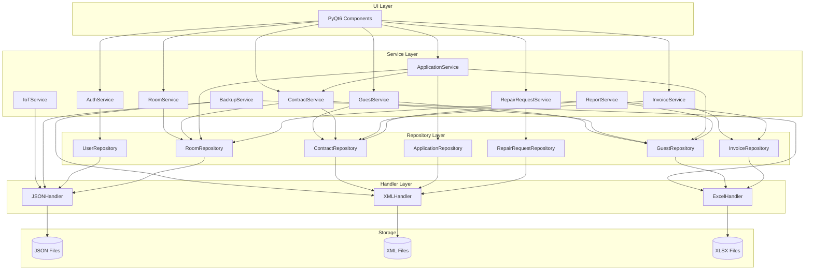
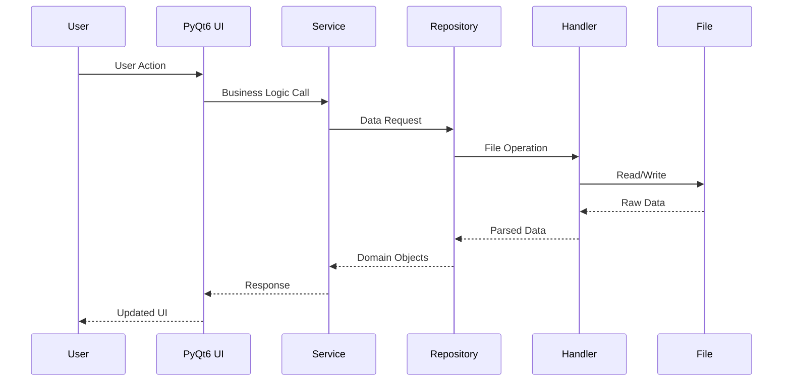
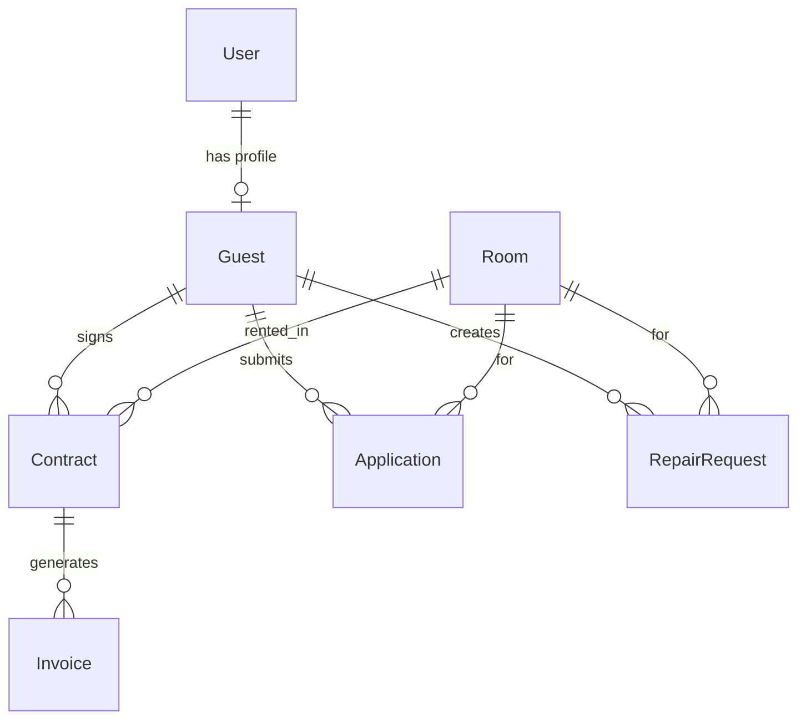
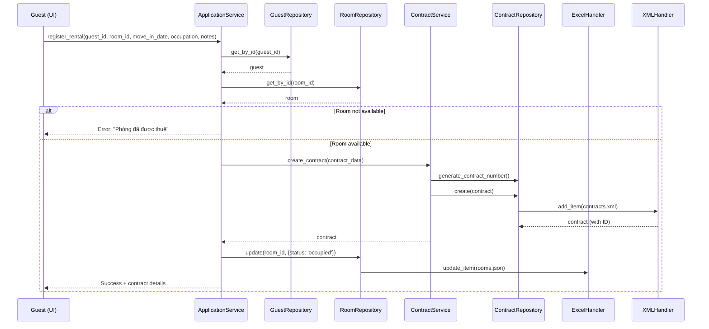
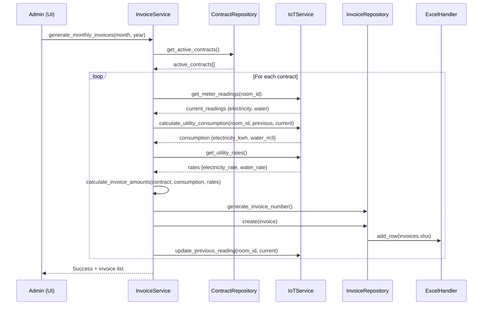
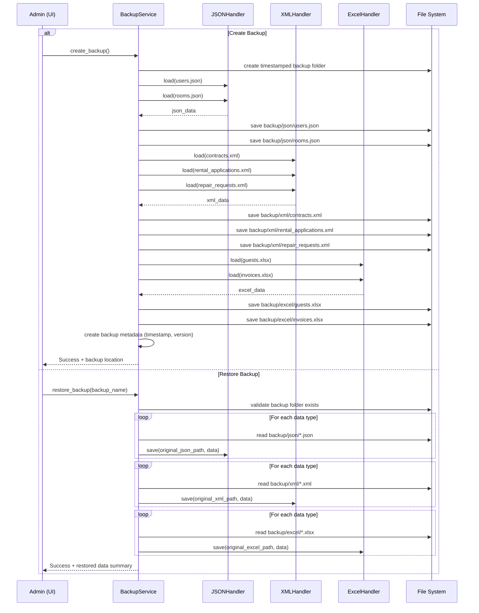
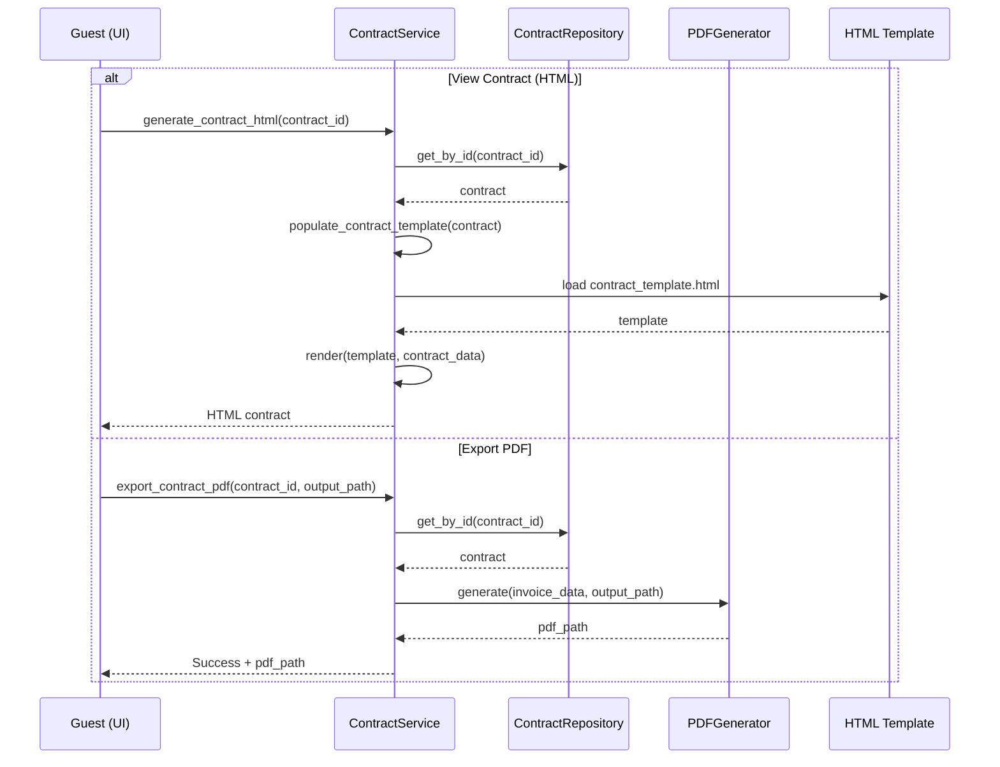

# Design Document - Hệ Thống Quản Lý Phòng Trọ

## Overview

Ứng dụng desktop quản lý phòng trọ theo kiến trúc MVC với Python + PyQt6. Lưu trữ đa định dạng (JSON/XML/XLSX). Hai roles: Admin (toàn quyền) và Guest (hạn chế). Tính năng đặc biệt: IoT Module giả lập đọc số điện nước, Contract Display (HTML + PDF export).

**UI đã có sẵn** (PyQt6, do user làm). Document này tập trung vào **backend architecture**. UI sẽ được merge vào sau và kết nối với backend services qua ServiceContainer.

## Technology Stack & Dependencies

```
# requirements.txt
PyQt6>=6.6.0
pandas>=2.1.0
openpyxl>=3.1.2
bcrypt>=4.0.1
reportlab>=4.0.4
lxml>=4.9.3
```

## Project Structure

```
room_management/
├── main.py
├── config/
│   ├── __init__.py
│   ├── settings.py
│   ├── constants.py
│   └── container.py          # ServiceContainer (DI)
├── models/
│   ├── __init__.py
│   ├── user.py
│   ├── room.py
│   ├── guest.py               # NOT tenant.py
│   ├── contract.py
│   ├── invoice.py
│   ├── application.py
│   └── repair_request.py
├── handlers/
│   ├── __init__.py
│   ├── json_handler.py
│   ├── xml_handler.py
│   └── excel_handler.py
├── repositories/
│   ├── __init__.py
│   ├── base_repository.py
│   ├── user_repository.py
│   ├── room_repository.py
│   ├── guest_repository.py    # NOT tenant_repository.py
│   ├── contract_repository.py
│   ├── invoice_repository.py
│   ├── application_repository.py
│   └── repair_request_repository.py
├── services/
│   ├── __init__.py
│   ├── auth_service.py
│   ├── room_service.py
│   ├── guest_service.py       # NOT tenant_service.py
│   ├── contract_service.py
│   ├── invoice_service.py
│   ├── application_service.py
│   ├── repair_request_service.py
│   ├── iot_service.py
│   ├── backup_service.py
│   └── report_service.py
├── ui/                        # DO NOT CREATE — UI đã được làm sẵn bằng PyQt6
│   └── (sẽ được merge từ code UI có sẵn của user)
├── utils/
│   ├── __init__.py
│   ├── validators.py
│   ├── formatters.py
│   ├── pdf_generator.py
│   └── logger.py
├── data/
│   ├── json/
│   │   ├── users.json
│   │   ├── rooms.json
│   │   └── system_settings.json
│   ├── xml/
│   │   ├── contracts.xml
│   │   ├── rental_applications.xml
│   │   └── repair_requests.xml
│   ├── excel/
│   │   ├── guests.xlsx         # NOT tenants.xlsx
│   │   └── invoices.xlsx
│   ├── backups/
│   ├── exports/
│   └── templates/
│       └── contract_template.html
└── requirements.txt
```

## Architecture

### System Architecture



### Data Flow



## Constants & Enums

```python
# config/constants.py
from pathlib import Path

BASE_DIR = Path(__file__).parent.parent
DATA_DIR = BASE_DIR / 'data'

# File paths
JSON_DIR = DATA_DIR / 'json'
USERS_FILE = str(JSON_DIR / 'users.json')
ROOMS_FILE = str(JSON_DIR / 'rooms.json')
SETTINGS_FILE = str(JSON_DIR / 'system_settings.json')

XML_DIR = DATA_DIR / 'xml'
CONTRACTS_FILE = str(XML_DIR / 'contracts.xml')
APPLICATIONS_FILE = str(XML_DIR / 'rental_applications.xml')
REPAIRS_FILE = str(XML_DIR / 'repair_requests.xml')

EXCEL_DIR = DATA_DIR / 'excel'
GUESTS_FILE = str(EXCEL_DIR / 'guests.xlsx')
INVOICES_FILE = str(EXCEL_DIR / 'invoices.xlsx')

BACKUPS_DIR = DATA_DIR / 'backups'
EXPORTS_DIR = DATA_DIR / 'exports'
TEMPLATES_DIR = DATA_DIR / 'templates'

# Status constants
ROOM_STATUS = {'AVAILABLE': 'available', 'OCCUPIED': 'occupied', 'MAINTENANCE': 'maintenance'}
CONTRACT_STATUS = {'ACTIVE': 'active', 'EXPIRED': 'expired', 'TERMINATED': 'terminated'}
INVOICE_STATUS = {'UNPAID': 'unpaid', 'PAID': 'paid', 'OVERDUE': 'overdue'}
APPLICATION_STATUS = {'COMPLETED': 'completed', 'CANCELLED': 'cancelled'}
REPAIR_STATUS = {'PENDING': 'pending', 'IN_PROGRESS': 'in_progress', 'COMPLETED': 'completed'}
REPAIR_PRIORITY = {'LOW': 'low', 'MEDIUM': 'medium', 'HIGH': 'high', 'URGENT': 'urgent'}
USER_ROLES = {'ADMIN': 'admin', 'GUEST': 'guest'}

# System defaults
DEFAULT_ELECTRICITY_RATE = 3500      # VND per kWh
DEFAULT_WATER_RATE = 25000           # VND per m³
DEFAULT_CONTRACT_DURATION = 12       # months
DEFAULT_INVOICE_DUE_DAYS = 5         # days from generation
DEFAULT_BACKUP_RETENTION_DAYS = 30
DEFAULT_SESSION_TIMEOUT_MINUTES = 30
DEFAULT_PAGE_SIZE = 20
```

## Data Models

### User Model
```python
@dataclass
class User:
    id: Optional[int]
    email: str
    phone: str
    password_hash: str
    full_name: str
    role: str  # USER_ROLES values only
    is_active: bool = True
    created_at: Optional[datetime] = None
    updated_at: Optional[datetime] = None

    def set_password(self, password: str) -> None: ...
    def check_password(self, password: str) -> bool: ...
    def to_dict(self) -> dict: ...
    @classmethod
    def from_dict(cls, data: dict) -> 'User': ...
```

### Room Model
```python
@dataclass
class Room:
    id: Optional[int]
    room_number: str
    floor: int
    area: float       # m²
    price: int         # VND/month
    deposit: int       # VND
    status: str        # ROOM_STATUS values only
    description: str
    amenities: List[str]
    images: List[str]
    created_at: Optional[datetime] = None
    updated_at: Optional[datetime] = None

    def is_available(self) -> bool: ...
    def to_dict(self) -> dict: ...
    @classmethod
    def from_dict(cls, data: dict) -> 'Room': ...
```

### Guest Model
```python
@dataclass
class Guest:
    id: Optional[int]
    user_id: int       # FK -> User.id
    full_name: str
    phone: str
    email: str
    id_card: str
    address: str
    occupation: str
    created_at: Optional[datetime] = None
    updated_at: Optional[datetime] = None

    def to_dict(self) -> dict: ...
    @classmethod
    def from_dict(cls, data: dict) -> 'Guest': ...
```

### Contract Model
```python
@dataclass
class Contract:
    id: Optional[int]
    contract_number: str  # Format: HD[YYYY][MM][NNN], e.g. HD202401001
    room_id: int          # FK -> Room.id
    guest_id: int         # FK -> Guest.id
    start_date: date
    end_date: date
    monthly_rent: int     # VND
    deposit: int          # VND
    status: str           # CONTRACT_STATUS values only
    created_at: Optional[datetime] = None
    updated_at: Optional[datetime] = None

    def is_active(self) -> bool: ...
    def is_expired(self) -> bool: ...
    def days_until_expiry(self) -> int: ...
    def to_dict(self) -> dict: ...
    @classmethod
    def from_dict(cls, data: dict) -> 'Contract': ...
```

### Invoice Model
```python
@dataclass
class Invoice:
    id: Optional[int]
    invoice_number: str   # Format: INV[YYYY][MM][NNN], e.g. INV202401001
    contract_id: int      # FK -> Contract.id
    month: int
    year: int
    room_rent: int        # VND
    electricity_cost: int # VND
    water_cost: int       # VND
    other_fees: int       # VND
    total_amount: int     # = room_rent + electricity_cost + water_cost + other_fees
    status: str           # INVOICE_STATUS values only
    due_date: date        # = created_at + INVOICE_DUE_DAYS
    payment_date: Optional[date] = None
    payment_method: Optional[str] = None
    created_at: Optional[datetime] = None

    def is_overdue(self) -> bool: ...
    def days_overdue(self) -> int: ...
    def to_dict(self) -> dict: ...
    @classmethod
    def from_dict(cls, data: dict) -> 'Invoice': ...
```

### Application Model (Rental Registration)
```python
@dataclass
class Application:
    id: Optional[int]
    guest_id: int         # FK -> Guest.id
    room_id: int          # FK -> Room.id
    contract_id: Optional[int]  # FK -> Contract.id (auto-created on submit)
    status: str           # APPLICATION_STATUS values only ('completed' or 'cancelled')
    move_in_date: date
    occupation: str
    additional_notes: str
    created_at: Optional[datetime] = None

    def to_dict(self) -> dict: ...
    @classmethod
    def from_dict(cls, data: dict) -> 'Application': ...
```

### RepairRequest Model
```python
@dataclass
class RepairRequest:
    id: Optional[int]
    guest_id: int         # FK -> Guest.id
    room_id: int          # FK -> Room.id
    title: str
    description: str
    priority: str         # REPAIR_PRIORITY values only
    status: str           # REPAIR_STATUS values only
    created_at: Optional[datetime] = None
    updated_at: Optional[datetime] = None
    completed_at: Optional[datetime] = None

    def to_dict(self) -> dict: ...
    @classmethod
    def from_dict(cls, data: dict) -> 'RepairRequest': ...
```

### Data Relationships



## Data Format Examples

### JSON: users.json
```json
{
  "users": [
    {
      "id": 1,
      "email": "admin@example.com",
      "phone": "0123456789",
      "password_hash": "$2b$12$...",
      "full_name": "Nguyễn Văn A",
      "role": "admin",
      "is_active": true,
      "created_at": "2024-01-15T10:00:00",
      "updated_at": "2024-01-15T10:00:00"
    }
  ],
  "last_id": 1
}
```

### JSON: rooms.json
```json
{
  "rooms": [
    {
      "id": 1,
      "room_number": "101",
      "floor": 1,
      "area": 25.0,
      "price": 3000000,
      "deposit": 3000000,
      "status": "available",
      "description": "Phòng đầy đủ tiện nghi",
      "amenities": ["Điều hòa", "Nóng lạnh", "Tủ lạnh"],
      "images": ["room_101_1.jpg"],
      "created_at": "2024-01-15T10:00:00",
      "updated_at": "2024-01-15T10:00:00"
    }
  ],
  "last_id": 1
}
```

### JSON: system_settings.json
```json
{
  "electricity_rate": 3500,
  "water_rate": 25000,
  "default_contract_duration": 12,
  "invoice_due_days": 5,
  "backup_retention_days": 30,
  "session_timeout_minutes": 30
}
```

### XML: contracts.xml
```xml
<?xml version="1.0" encoding="UTF-8"?>
<contracts>
    <contract>
        <id>1</id>
        <contract_number>HD202401001</contract_number>
        <room_id>1</room_id>
        <guest_id>1</guest_id>
        <start_date>2024-01-01</start_date>
        <end_date>2024-12-31</end_date>
        <monthly_rent>3000000</monthly_rent>
        <deposit>3000000</deposit>
        <status>active</status>
        <created_at>2024-01-15T10:00:00</created_at>
        <updated_at>2024-01-15T10:00:00</updated_at>
    </contract>
</contracts>
```

### XML: rental_applications.xml
```xml
<?xml version="1.0" encoding="UTF-8"?>
<applications>
    <application>
        <id>1</id>
        <guest_id>1</guest_id>
        <room_id>1</room_id>
        <contract_id>1</contract_id>
        <status>completed</status>
        <move_in_date>2024-02-01</move_in_date>
        <occupation>Nhân viên văn phòng</occupation>
        <additional_notes>Không nuôi thú cưng</additional_notes>
        <created_at>2024-01-20T14:30:00</created_at>
    </application>
</applications>
```

### XML: repair_requests.xml
```xml
<?xml version="1.0" encoding="UTF-8"?>
<repair_requests>
    <repair_request>
        <id>1</id>
        <guest_id>1</guest_id>
        <room_id>1</room_id>
        <title>Hỏng vòi nước</title>
        <description>Vòi nước nhà tắm bị rỉ</description>
        <priority>medium</priority>
        <status>pending</status>
        <created_at>2024-02-10T09:00:00</created_at>
        <updated_at>2024-02-10T09:00:00</updated_at>
    </repair_request>
</repair_requests>
```

### XLSX: guests.xlsx

| id | user_id | full_name | phone | email | id_card | address | occupation | created_at | updated_at |
|----|---------|-----------|-------|-------|---------|---------|------------|------------|------------|
| 1 | 2 | Trần Văn B | 0987654321 | guest@example.com | 079123456789 | Quận 1, TP.HCM | Nhân viên | 2024-01-15 | 2024-01-15 |

### XLSX: invoices.xlsx

| id | invoice_number | contract_id | month | year | room_rent | electricity_cost | water_cost | other_fees | total_amount | status | due_date | payment_date | payment_method | created_at |
|----|----------------|-------------|-------|------|-----------|-----------------|------------|------------|--------------|--------|----------|--------------|----------------|------------|
| 1 | INV202401001 | 1 | 1 | 2024 | 3000000 | 350000 | 150000 | 100000 | 3600000 | unpaid | 2024-02-05 | | | 2024-01-31 |

## Service Interfaces

### 1. AuthService
```python
class AuthService:
    def __init__(self, user_repo: UserRepository): ...
    def login(self, email_or_phone: str, password: str) -> Tuple[bool, str, Optional[User]]: ...
    def register(self, email: str, phone: str, password: str, full_name: str) -> Tuple[bool, str]: ...
    def logout(self) -> None: ...
    def get_current_user(self) -> Optional[User]: ...
    def is_admin(self) -> bool: ...
```

### 2. RoomService
```python
class RoomService:
    def __init__(self, room_repo: RoomRepository, contract_repo: ContractRepository): ...
    def create_room(self, room_data: dict) -> Tuple[bool, str, Optional[Room]]: ...
    def update_room(self, room_id: int, updates: dict) -> Tuple[bool, str]: ...
    def delete_room(self, room_id: int) -> Tuple[bool, str]: ...
    def get_available_rooms(self) -> List[Room]: ...
    def get_room_by_id(self, room_id: int) -> Optional[Room]: ...
    def get_all_rooms(self) -> List[Room]: ...
    def update_room_status(self, room_id: int, status: str) -> bool: ...
    def filter_rooms_by_status(self, status: str) -> List[Room]:
        """Filter rooms: 'available' (trống) hoặc 'occupied' (đang thuê)."""
        ...
```

### 3. GuestService
```python
class GuestService:
    def __init__(self, guest_repo: GuestRepository, contract_repo: ContractRepository): ...
    def create_guest(self, guest_data: dict) -> Tuple[bool, str, Optional[Guest]]: ...
    def update_guest(self, guest_id: int, updates: dict) -> Tuple[bool, str]: ...
    def delete_guest(self, guest_id: int) -> Tuple[bool, str]: ...
    def get_all_guests(self) -> List[Guest]: ...
    def get_guest_by_id(self, guest_id: int) -> Optional[Guest]: ...
    def get_guest_by_user_id(self, user_id: int) -> Optional[Guest]: ...
    def search_guests_by_name(self, name: str) -> List[Guest]:
        """Tìm kiếm guest theo tên."""
        ...
    def filter_guests_by_rental_status(self, status: str) -> List[Guest]:
        """Filter guests: 'active' (đang thuê), 'expiring' (sắp hết hạn), 'terminated' (đã chấm dứt).
        - active: có contract status='active' và end_date > 30 ngày
        - expiring: có contract status='active' và end_date <= 30 ngày
        - terminated: chỉ có contracts status='expired' hoặc 'terminated', không có active
        """
        ...
```

### 4. ContractService
```python
class ContractService:
    def __init__(self, contract_repo: ContractRepository, room_repo: RoomRepository, guest_repo: GuestRepository): ...
    def create_contract(self, contract_data: dict) -> Tuple[bool, str, Optional[Contract]]: ...
    def create_from_application(self, application_id: int) -> Tuple[bool, str, Optional[Contract]]: ...
    def terminate_contract(self, contract_id: int) -> Tuple[bool, str]: ...
    def get_active_contracts(self) -> List[Contract]: ...
    def check_expired_contracts(self) -> List[Contract]: ...
    def generate_contract_number(self) -> str: ...
    def generate_contract_html(self, contract_id: int) -> str: ...
    def export_contract_pdf(self, contract_id: int, output_path: str) -> bool: ...
```

### 5. InvoiceService
```python
class InvoiceService:
    def __init__(self, invoice_repo: InvoiceRepository, contract_repo: ContractRepository, iot_service: IoTService): ...
    def generate_monthly_invoices(self, month: int, year: int) -> List[Invoice]:
        """Admin bấm 'Tạo hóa đơn hàng tháng' tại mục quản lý phòng →
        1. Kết nối IoT, ghi nhận chỉ số điện/nước cho tất cả phòng đang thuê
        2. Tính consumption = current - previous, nhân đơn giá
        3. Tạo hóa đơn cho từng hợp đồng active
        4. Cập nhật previous_reading = current_reading"""
        ...
    def generate_invoice_for_contract(self, contract_id: int, month: int, year: int) -> Tuple[bool, str, Optional[Invoice]]: ...
    def mark_as_paid(self, invoice_id: int, payment_method: str) -> Tuple[bool, str]: ...
    def get_overdue_invoices(self) -> List[Invoice]: ...
    def get_invoices_by_guest(self, guest_id: int) -> List[Invoice]: ...
    def generate_invoice_number(self) -> str: ...
    def filter_invoices(self, month: int = None, year: int = None, paid: bool = None) -> List[Invoice]:
        """Filter invoices. paid=True → 'paid', paid=False → 'unpaid'+'overdue', None → tất cả."""
        ...
```

### 6. ApplicationService (Rental Registration)
```python
class ApplicationService:
    def __init__(self, app_repo: ApplicationRepository, room_repo: RoomRepository, guest_repo: GuestRepository, contract_service: ContractService): ...
    def register_rental(self, guest_id: int, room_id: int, move_in_date: date, occupation: str, notes: str) -> Tuple[bool, str, Optional[Contract]]:
        """Guest đăng ký thuê phòng → tự động tạo hợp đồng, cập nhật room status. Không cần admin duyệt."""
        ...
    def cancel_registration(self, application_id: int) -> Tuple[bool, str]: ...
    def get_all_registrations(self) -> List[Application]: ...
    def get_registrations_by_guest(self, guest_id: int) -> List[Application]: ...
```

### 7. RepairRequestService
```python
class RepairRequestService:
    def __init__(self, repair_repo: RepairRequestRepository): ...
    def submit_request(self, guest_id: int, room_id: int, title: str, description: str, priority: str) -> Tuple[bool, str]: ...
    def update_status(self, request_id: int, status: str) -> Tuple[bool, str]: ...
    def get_all_requests(self) -> List[RepairRequest]: ...
    def get_requests_by_guest(self, guest_id: int) -> List[RepairRequest]: ...
    def get_requests_by_room(self, room_id: int) -> List[RepairRequest]: ...
```

### 8. IoTService
```python
class IoTService:
    def __init__(self): ...
    def get_meter_readings(self, room_id: int) -> Dict[str, float]: ...
    def simulate_monthly_readings(self) -> Dict[int, Dict[str, float]]: ...
    def calculate_utility_consumption(self, room_id: int, previous: Dict, current: Dict) -> Dict[str, float]: ...
    def get_utility_rates(self) -> Dict[str, float]: ...
    def set_utility_rates(self, rates: Dict[str, float]) -> bool: ...
```

### 9. BackupService
```python
class BackupService:
    def __init__(self): ...
    def create_backup(self) -> Tuple[bool, str]: ...
    def restore_backup(self, backup_name: str) -> Tuple[bool, str]: ...
    def list_backups(self) -> List[Dict]: ...
    def cleanup_old_backups(self, retention_days: int) -> int: ...
```

### 10. ReportService
```python
class ReportService:
    def __init__(self, invoice_repo: InvoiceRepository, room_repo: RoomRepository, contract_repo: ContractRepository, guest_repo: GuestRepository): ...
    def get_monthly_revenue(self, month: int, year: int) -> Dict: ...
    def get_occupancy_stats(self) -> Dict: ...
    def get_guest_stats(self) -> Dict: ...
    def export_report_pdf(self, report_data: Dict, output_path: str) -> bool: ...
    def export_report_excel(self, report_data: Dict, output_path: str) -> bool: ...
```

## File Handler Interfaces

### JSONHandler
```python
class JSONHandler:
    @staticmethod
    def load(file_path: str) -> Dict: ...
    @staticmethod
    def save(file_path: str, data: Dict) -> None: ...
    @staticmethod
    def add_item(file_path: str, item: Dict, list_key: str = 'items') -> Dict: ...
    @staticmethod
    def update_item(file_path: str, item_id: int, updates: Dict, list_key: str = 'items') -> bool: ...
    @staticmethod
    def delete_item(file_path: str, item_id: int, list_key: str = 'items') -> bool: ...
    @staticmethod
    def find_by_id(file_path: str, item_id: int, list_key: str = 'items') -> Optional[Dict]: ...
    @staticmethod
    def get_all(file_path: str, list_key: str = 'items') -> List[Dict]: ...
```

### XMLHandler
```python
class XMLHandler:
    @staticmethod
    def load(file_path: str, root_tag: str = 'items') -> ET.Element: ...
    @staticmethod
    def save(file_path: str, root: ET.Element) -> None: ...
    @staticmethod
    def add_item(file_path: str, item_data: Dict, root_tag: str, item_tag: str) -> int: ...
    @staticmethod
    def update_item(file_path: str, item_id: int, updates: Dict, root_tag: str, item_tag: str) -> bool: ...
    @staticmethod
    def delete_item(file_path: str, item_id: int, root_tag: str, item_tag: str) -> bool: ...
    @staticmethod
    def element_to_dict(element: ET.Element) -> Dict: ...
    @staticmethod
    def get_all(file_path: str, root_tag: str, item_tag: str) -> List[Dict]: ...
```

### ExcelHandler
```python
class ExcelHandler:
    @staticmethod
    def load(file_path: str) -> pd.DataFrame: ...
    @staticmethod
    def save(file_path: str, df: pd.DataFrame) -> None: ...
    @staticmethod
    def add_row(file_path: str, row_data: Dict) -> int: ...
    @staticmethod
    def update_row(file_path: str, row_id: int, updates: Dict) -> bool: ...
    @staticmethod
    def delete_row(file_path: str, row_id: int) -> bool: ...
    @staticmethod
    def find_by_id(file_path: str, row_id: int) -> Optional[Dict]: ...
    @staticmethod
    def get_all(file_path: str) -> List[Dict]: ...
```

## Repository Interfaces

### BaseRepository
```python
class BaseRepository(Generic[T]):
    def get_by_id(self, id: int) -> Optional[T]: ...
    def get_all(self) -> List[T]: ...
    def create(self, entity: T) -> T: ...
    def update(self, entity: T) -> bool: ...
    def delete(self, id: int) -> bool: ...
```

### Specialized Repositories
```python
class UserRepository(BaseRepository[User]):
    # Storage: JSON (users.json, list_key='users')
    def get_by_email(self, email: str) -> Optional[User]: ...
    def get_by_phone(self, phone: str) -> Optional[User]: ...
    def authenticate(self, login: str, password: str) -> Optional[User]: ...

class RoomRepository(BaseRepository[Room]):
    # Storage: JSON (rooms.json, list_key='rooms')
    def get_available_rooms(self) -> List[Room]: ...
    def get_by_status(self, status: str) -> List[Room]: ...

class GuestRepository(BaseRepository[Guest]):
    # Storage: XLSX (guests.xlsx)
    def get_by_user_id(self, user_id: int) -> Optional[Guest]: ...
    def search(self, query: str) -> List[Guest]: ...

class ContractRepository(BaseRepository[Contract]):
    # Storage: XML (contracts.xml, root_tag='contracts', item_tag='contract')
    def get_active_contracts(self) -> List[Contract]: ...
    def get_by_guest_id(self, guest_id: int) -> List[Contract]: ...
    def get_by_room_id(self, room_id: int) -> List[Contract]: ...
    def get_expired_contracts(self) -> List[Contract]: ...

class InvoiceRepository(BaseRepository[Invoice]):
    # Storage: XLSX (invoices.xlsx)
    def get_by_contract_id(self, contract_id: int) -> List[Invoice]: ...
    def get_by_status(self, status: str) -> List[Invoice]: ...
    def get_overdue(self) -> List[Invoice]: ...

class ApplicationRepository(BaseRepository[Application]):
    # Storage: XML (rental_applications.xml, root_tag='applications', item_tag='application')
    def get_by_guest_id(self, guest_id: int) -> List[Application]: ...
    def get_by_room_id(self, room_id: int) -> List[Application]: ...

class RepairRequestRepository(BaseRepository[RepairRequest]):
    # Storage: XML (repair_requests.xml, root_tag='repair_requests', item_tag='repair_request')
    def get_by_guest_id(self, guest_id: int) -> List[RepairRequest]: ...
    def get_by_room_id(self, room_id: int) -> List[RepairRequest]: ...
    def get_by_status(self, status: str) -> List[RepairRequest]: ...
```

## Dependency Injection

```python
# config/container.py
class ServiceContainer:
    """Singleton container quản lý tất cả dependencies."""
    _instance = None

    def __new__(cls):
        if cls._instance is None:
            cls._instance = super().__new__(cls)
            cls._instance._initialized = False
        return cls._instance

    def __init__(self):
        if self._initialized:
            return

        # Handlers are stateless, used internally by repositories

        # Repositories
        self.user_repo = UserRepository()
        self.room_repo = RoomRepository()
        self.guest_repo = GuestRepository()
        self.contract_repo = ContractRepository()
        self.invoice_repo = InvoiceRepository()
        self.application_repo = ApplicationRepository()
        self.repair_repo = RepairRequestRepository()

        # Services
        self.iot_service = IoTService()
        self.auth_service = AuthService(self.user_repo)
        self.room_service = RoomService(self.room_repo, self.contract_repo)
        self.guest_service = GuestService(self.guest_repo, self.contract_repo)
        self.contract_service = ContractService(self.contract_repo, self.room_repo, self.guest_repo)
        self.invoice_service = InvoiceService(self.invoice_repo, self.contract_repo, self.iot_service)
        self.application_service = ApplicationService(self.application_repo, self.room_repo, self.guest_repo, self.contract_service)
        self.repair_service = RepairRequestService(self.repair_repo)
        self.backup_service = BackupService()
        self.report_service = ReportService(self.invoice_repo, self.room_repo, self.contract_repo, self.guest_repo)

        self._initialized = True
```

## Detailed Sequence Diagrams

### 1. Guest Registration → Create Contract Flow



### 2. Admin Monthly Invoice Generation → IoT → Invoice Flow



### 3. Backup & Restore Flow



### 4. Contract Display & PDF Export Flow



## Error Handling

### Error Class Hierarchy
```python
class AppError(Exception):
    """Base exception for application errors."""
    def __init__(self, message: str):
        self.message = message
        super().__init__(self.message)

class AuthenticationError(AppError):
    """Login/register failures."""
    pass

class ValidationError(AppError):
    """Input validation failures."""
    def __init__(self, field: str, message: str):
        self.field = field
        super().__init__(f"{field}: {message}")

class BusinessRuleError(AppError):
    """Business rule violations (e.g. delete occupied room)."""
    pass

class FileError(AppError):
    """File I/O errors (not found, corrupted, permission denied)."""
    def __init__(self, file_path: str, message: str):
        self.file_path = file_path
        super().__init__(f"{file_path}: {message}")

class NotFoundError(AppError):
    """Entity not found."""
    def __init__(self, entity_type: str, entity_id: int):
        super().__init__(f"{entity_type} with id={entity_id} not found")
```

### Error Handling Strategy

| Error Type | Handler Action |
|------------|---------------|
| AuthenticationError | Return generic "Invalid credentials" message (never reveal if email exists) |
| ValidationError | Return specific field-level error message |
| BusinessRuleError | Return explanation of why action is not allowed |
| FileError (not found) | Create default file structure, retry operation |
| FileError (corrupted) | Attempt restore from backup, log incident |
| IoT failure | Fall back to manual input mode |


